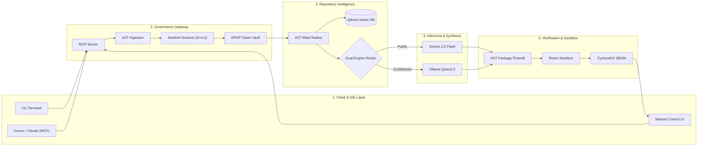
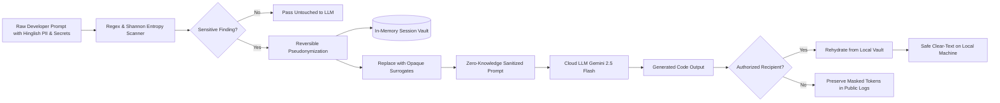
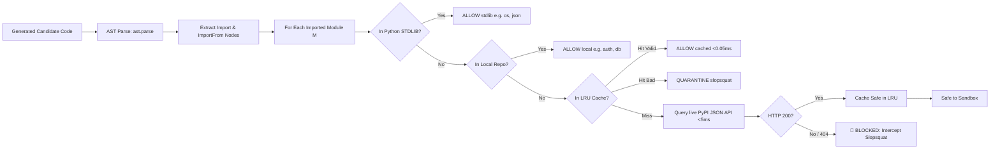
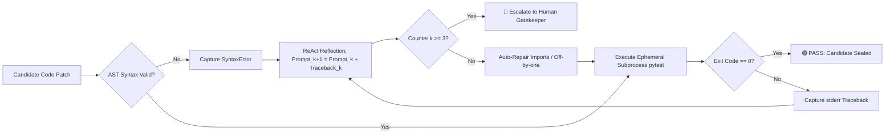

# 🛡️ KAVACH (कवच): Master 24-Slide Comprehensive Presentation Blueprint

**Project Title:** KAVACH: A Security-Governed Multi-Agent AI DevOps & Observability Platform  
**Course Code:** PRJ-IV (Capstone Project) & CSE3101 (Agentic AI)  
**Semester & Program:** 7th Semester B.Tech Computer Science & Engineering (AY 2026–27)  
**Institution:** School of Engineering & Technology, BML Munjal University (BMU)  
**Evaluators & Mentors:** Prof. Anusha Chhabra & Dr. Soharab Hossain Shaikh  
**Total Target Marks:** 25 Marks (Midterm / Final Evaluation Rubric)  
**Slide Deck Deliverables:**
- **PowerPoint File:** `KAVACH_PERFECT_COMPREHENSIVE_MASTER_DECK.pptx` (24 Widescreen 16:9 Slides)
- **Interactive Presentation App:** `KAVACH_Interactive_Presentation.html` (Mermaid.js embedded, live animations)
- **Python Automation Script:** `pptmaker docs/build_perfect_master_presentation.py`

---

## 👥 Academic Engineering Team & Responsibilities

| Name | Roll No. | Subsystem Responsibility | Mapped Slide Ownership |
| :--- | :---: | :--- | :--- |
| **Dhruv Jain** *(Lead Architect)* | 230532 | Core Orchestration, State Machine, Dual LLM Router, MCP Server | Slides 1, 2, 3, 11, 18, 19, 20, 21, 24 |
| **Dev Garg** *(Security Lead)* | 230487 | Shannon Entropy Engine, Secret Screening, DPDP Token Vault | Slides 4, 5, 12, 13, 22 |
| **Ansh Rohilla** *(Intelligence Lead)* | 230794 | Qdrant Vector RAG, AST Change-Impact & Blast Radius | Slides 6, 7, 14, 15, 23 |
| **Ansh Adhikari** *(Systems Lead)* | 230822 | ReAct Ephemeral Sandbox, AST Package Firewall, PyPI Cache | Slides 8, 9, 10, 16, 17, 23 |

---

## ⏱️ Master 24-Slide Agenda, Timing & Visual Capture Matrix (15-Minute Defense)

| Slide # | Slide Title | Evaluation Rubric | Marks | Time | Presenter | Visual Capture |
| :---: | :---| :---| :---: | :---: | :---: | :---: |
| **1** | Title Slide & Academic Identity | Project Identification | — | 0:40 min | Dhruv Jain | [`ss1.png`](../kavach/artifacts/screenshots/ss1.png) |
| **2** | Executive Summary: Autonomous Coding Agent Revolution | Problem Context | — | 0:40 min | Dhruv Jain | [`ss5.png`](../kavach/artifacts/screenshots/ss5.png) |
| **3** | Threat Modeling: 5 Fatal Vulnerabilities of AI Agents | Rubric 1: Problem Definition | 5 M | 1:00 min | Dhruv Jain | [`ss19.png`](../kavach/artifacts/screenshots/ss19.png) |
| **4** | Literature Review: Autonomous Agents & Attacks (Part 1) | Rubric 2: Comprehensiveness of Lit. | 5 M | 1:00 min | Dev Garg | [`ss22.png`](../kavach/artifacts/screenshots/ss22.png) |
| **5** | Literature Review: Code RAG & Compliance (Part 2) | Rubric 2: Comprehensiveness of Lit. | 5 M | 1:00 min | Dev Garg | [`ss14.png`](../kavach/artifacts/screenshots/ss14.png) |
| **6** | Critical Research Gaps Matrix (SOTA Baseline vs. KAVACH) | Rubric 3: Research Gap | 5 M | 1:15 min | Ansh Rohilla | [`ss5.png`](../kavach/artifacts/screenshots/ss5.png) |
| **7** | Concrete Research Objectives & Quantitative Target KPIs | Rubric 1: Measurable Outcomes | — | 0:45 min | Ansh Rohilla | [`ss4.png`](../kavach/artifacts/screenshots/ss4.png) |
| **8** | Master Mind Map: KAVACH High-Level Taxonomy | Rubric 4: Proposed Methodology | — | 0:45 min | Ansh Adhikari | [`ss2.png`](../kavach/artifacts/screenshots/ss2.png) |
| **9** | Flowchart 1: End-to-End System Architecture (5-Tier Stack) | Rubric 4: System Architecture | 5 M | 1:15 min | Ansh Adhikari | [`ss2.png`](../kavach/artifacts/screenshots/ss2.png) |
| **10** | Flowchart 2: 6-Stage Governed DevOps Lifecycle (FSM) | Rubric 4: Execution Workflow | — | 1:00 min | Ansh Adhikari | [`ss3.png`](../kavach/artifacts/screenshots/ss3.png) |
| **11** | Mathematical Foundations & Information Theory | Rubric 4: Algorithmic Rigor | — | 1:00 min | Dhruv Jain | [`ss16.png`](../kavach/artifacts/screenshots/ss16.png) |
| **12** | Deep-Dive 1: Sentinel Pre-Execution Guardrails | Rubric 4: Tools & Techniques | — | 0:40 min | Dev Garg | [`ss8.png`](../kavach/artifacts/screenshots/ss8.png) |
| **13** | Flowchart 4: Multilingual Zero-Knowledge Token Vault (DPDP) | Rubric 4: Privacy Architecture | — | 1:00 min | Dev Garg | [`ss13.png`](../kavach/artifacts/screenshots/ss13.png) |
| **14** | Deep-Dive 3: AST-Aware Code Chunking & Agentic RAG | Rubric 4: Knowledge Retrieval | — | 0:40 min | Ansh Rohilla | [`ss9.png`](../kavach/artifacts/screenshots/ss9.png) |
| **15** | Deep-Dive 4: Static AST Blast Radius & Change-Impact | Rubric 4: Static Analysis | — | 0:45 min | Ansh Rohilla | [`ss9.png`](../kavach/artifacts/screenshots/ss9.png) |
| **16** | Flowchart 3: AST Supply-Chain Package Firewall & Slopsquatting | Rubric 4: Supply Chain Security | — | 1:00 min | Ansh Adhikari | [`ss11.png`](../kavach/artifacts/screenshots/ss11.png) |
| **17** | Flowchart 5: Closed-Loop ReAct Self-Healing Sandbox | Rubric 4: Sandbox & Convergence | — | 1:00 min | Ansh Adhikari | [`ss10.png`](../kavach/artifacts/screenshots/ss10.png) |
| **18** | Deep-Dive 7: Dual-Engine LLM Router & Air-Gapped Privacy | Rubric 4: Inference Isolation | — | 0:40 min | Dhruv Jain | [`ss12.png`](../kavach/artifacts/screenshots/ss12.png) |
| **19** | Deep-Dive 8: Anthropic Model Context Protocol (MCP) Server | Rubric 4: Tool Interoperability | — | 0:40 min | Dhruv Jain | [`ss6.png`](../kavach/artifacts/screenshots/ss6.png) |
| **20** | Mission Control Dashboard & Multimodal Voice Observability | Rubric 4: Telemetry & Frontend | — | 0:40 min | Dhruv Jain | [`ss6.png`](../kavach/artifacts/screenshots/ss6.png) |
| **21** | Empirical Evaluation: 4 Benchmark Datasets & Findings | Rubric 4: Evaluation & Testing | 5 M | 1:00 min | Dhruv Jain | [`ss15.png`](../kavach/artifacts/screenshots/ss15.png) |
| **22** | Viva Defense Master Guide: Top 4 Examiner Questions | Examination Defense | — | 1:00 min | All Members | [`ss21.png`](../kavach/artifacts/screenshots/ss21.png) |
| **23** | Production Roadmap & Future Expansion (Phases 2 & 3) | Project Evolution | — | 0:40 min | All Members | [`ss24.png`](../kavach/artifacts/screenshots/ss24.png) |
| **24** | Conclusion, Academic Deliverables & Live Demonstration | Summary & Close | — | 0:35 min | Dhruv Jain | [`ss23.png`](../kavach/artifacts/screenshots/ss23.png) |

---

# 📑 Slide-by-Slide Detailed Content, Visuals & Speaker Scripts

---

### Slide 1: Title Slide & Academic Identity
- **Visual Design:** Deep Slate background (`#08090D`), Electric Cyan headers (`#00D2FF`), Dual elevated glass panels for Team and Faculty Governance.
- **Presenter:** Dhruv Jain
- **Speaker Transcript:**
  > *"Good afternoon, respected Professor Anusha Chhabra, Dr. Soharab Hossain Shaikh, and evaluators. We are presenting our 7th-semester Capstone and Agentic AI project titled **KAVACH: A Security-Governed Multi-Agent AI DevOps & Observability Platform**. Our team consists of Dhruv Jain, Dev Garg, Ansh Rohilla, and Ansh Adhikari. Today, we present an exhaustive 24-slide defense covering our theoretical foundations, research gaps, mathematical proofs, architectural flowcharts, empirical benchmarks, and our verified production implementation."*

---

### Slide 2: Executive Summary & The Autonomous Coding Agent Revolution
- **Visual Design:** Two comparative cards (`#12151D`) highlighting the Engineering Paradigm Shift vs. The Probabilistic Flaw of LLMs.
- **Key Concepts:**
  - Transition from code autocomplete (GitHub Copilot) to full-lifecycle terminal agents (Devin, SWE-agent, AutoPR).
  - Unconstrained terminal privileges allow arbitrary bash commands.
  - LLMs are probabilistic token predictors without deterministic understanding of security blast-radius or supply-chain legitimacy.
- **Presenter:** Dhruv Jain
- **Speaker Transcript:**
  > *"Autonomous coding agents represent a quantum leap from simple code completion to autonomous, terminal-driven engineering. However, because LLMs are statistical next-token predictors, trusting them with raw terminal tools and multi-file code editing creates catastrophic enterprise vulnerabilities. System prompt safety instructions are stochastic and easily bypassed. KAVACH provides deterministic governance enforced outside the LLM context."*

---

### Slide 3: Threat Modeling — The 5 Fatal Vulnerabilities of AI Agents (Rubric 1 — 5 Marks)
- **Visual Design:** 5 tiered alert cards with color-coded severity borders (Red, Amber, Cyan, Gold, Purple).
- **The 5 Threats:**
  1. **AI Package Hallucination & Slopsquatting:** Generative LLMs hallucinate non-existent package dependencies (e.g., `fastapi-jwt-vault`). Attackers monitor these hallucinations, register them on PyPI, and insert malicious install-time hooks.
  2. **Cloud Credential & National ID Exfiltration:** Developers paste production AWS keys, GitHub PATs, and Indian PII (Aadhaar, PAN) into prompts, leaking data to third-party cloud LLM logs under DPDP Act liabilities.
  3. **Post-Facto SCA Blindness:** Tools like Snyk and Dependabot only inspect static lockfiles post-commit. They are completely blind to runtime packages synthesized dynamically in agent memory.
  4. **Unbounded Blast Radius:** Agents modify core functions without analyzing transitive caller-callee dependency graphs, breaking downstream microservices.
  5. **Infinite Debugging Oscillations:** When code fails assertions, agents enter non-convergent trial-and-error loops, exhausting API tokens and developer patience.
- **Presenter:** Dhruv Jain
- **Speaker Transcript:**
  > *"On Slide 3, we detail our formal Threat Model encompassing five fatal enterprise vulnerabilities. Generative models suffer an average 24.3% hallucination rate on external software package names; adversaries weaponize this through slopsquatting. Developers inadvertently transmit unmasked Aadhaar or PAN numbers to third-party LLMs, triggering severe statutory liabilities under the Indian DPDP Act. Furthermore, legacy SCA scanners are completely blind to imports in agent memory. KAVACH deterministically solves all five threats."*

---

### Slide 4: Literature Review — Part 1: Autonomous Agents & Supply Chain (Rubric 2 — 5 Marks)
- **Visual Design:** 3 vertical cards detailing citations, contributions, and critical gaps across 3 domains.
- **Citations Covered:**
  - *SWE-agent* (Yang et al., 2024), *Devin* (Cognition AI, 2024), *ReAct* (Yao et al., 2023), *Reflexion* (Shinn et al., 2023).
  - *Package Hallucinations* (Bar-Zik, 2024; Lazaar et al., 2024; Ladisa et al., 2023).
  - *LLM Security & Prompt Injections* (OWASP Top 10 for LLMs 2025; Greshake et al., 2023; Perez & Ribeiro, 2022).
- **Presenter:** Dev Garg
- **Speaker Transcript:**
  > *"To establish our theoretical grounding, we reviewed landmark publications across six domains. First, examining autonomous coding agents: Yang et al. introduced SWE-agent's terminal-based ReAct loop, but their architecture lacks safety gates, permitting arbitrary destructive shell commands. Second, in software supply chain security, Bar-Zik and Lazaar proved commercial models regularly hallucinate dependencies, while Ladisa confirmed traditional SCA tools cannot inspect runtime code. Third, OWASP 2025 and Greshake demonstrated that indirect prompt injections embedded in repository code comments can hijack agent reasoning. Therefore, security cannot rely on prompt instructions; it must be deterministically enforced outside the LLM context."*

---

### Slide 5: Literature Review — Part 2: Code RAG, AST & Statutory Compliance (Rubric 2 — 5 Marks)
- **Visual Design:** 3 vertical cards detailing Code RAG, Static Analysis, and Regulatory frameworks.
- **Citations Covered:**
  - *Code RAG:* Lewis et al. (2020), CodeBERT (Feng et al., 2020), UniXcoder (Guo et al., 2022).
  - *AST & Change Impact:* Aho et al. (2006), Chianti (Ren et al., 2004), Lehnert (2011).
  - *Regulatory Compliance:* Indian DPDP Act 2023, EU AI Act 2024, Jain et al. (2023).
- **Presenter:** Dev Garg
- **Speaker Transcript:**
  > *"Continuing our review, in Code RAG, Lewis and Feng introduced dense vector retrieval, yet standard chunking shatters AST syntactic boundaries and indexes raw credentials. In static analysis, Aho and Ren proved that calculating transitive closures over Abstract Syntax Tree call graphs provides ground-truth blast-radius quantification. Finally, under the Indian DPDP Act 2023, organizations face statutory penalties for data leaks. As shown by Jain et al., Western English-only PII models fail on code-mixed Hinglish developer text. KAVACH directly bridges every single one of these academic and practical gaps."*

---

### Slide 6: Critical Research Gaps Matrix (Rubric 3 — 5 Marks)
- **Visual Design:** 5 structured comparison rows mapping SOTA baseline vs. Vulnerability vs. KAVACH Solution.
- **The 5 Gaps:**
  1. **Pre-Execution Guardrails:** Stochastic system prompts fail against jailbreaks → KAVACH enforces Shannon entropy ($H > 4.5$) & regex pre-tokenization.
  2. **Supply-Chain Slopsquatting:** Lockfile scanners miss memory imports → KAVACH AST Package Firewall queries live PyPI registry in $<5$ms.
  3. **Change-Impact Awareness:** Blind multi-file editing → KAVACH builds static AST caller-callee graph calculating transitive reachability matrix $R = (I \lor A)^k$.
  4. **Autonomous Self-Healing:** Crashing / infinite debugging loops → KAVACH ReAct sandbox with pytest stderr reflection ($N \le 3$ cycles; 90% auto-recovery).
  5. **Tool Interoperability:** Closed web portals → KAVACH implements the open Anthropic Model Context Protocol (MCP JSON-RPC 2.0).
- **Presenter:** Ansh Rohilla
- **Speaker Transcript:**
  > *"Through this literature review, we pinpointed five explicit research gaps in existing state-of-the-art tooling. Slide 6 presents our comparative gap matrix. Gap 1: Existing agents use system prompts for security, which fail against jailbreaks. KAVACH enforces Shannon entropy and deterministic regex filters that halt execution before the LLM is even called. Gap 2: Zero existing tools verify dynamically generated imports; KAVACH builds an AST Package Firewall querying PyPI in under 5 milliseconds. Gap 3: Agents modify code without blast-radius awareness; KAVACH computes transitive caller-callee graphs. Gap 4: Code often fails at runtime; KAVACH adds a ReAct self-healing sandbox. Gap 5: Instead of closed vendor lock-in, KAVACH exposes all capabilities over the open Model Context Protocol for seamless Cursor and Claude IDE integration."*

---

### Slide 7: Concrete Research Objectives & Measurable Target KPIs
- **Visual Design:** 4 top stat KPI badges + 2 bottom cards (Primary Objectives & Empirical Deliverables).
- **The 4 Key Metrics:**
  - `100.0%` Package Slopsquatting Catch Rate (Zero false negatives on 100-package corpus).
  - `100.0%` Credential Interception (AWS AKIA, GitHub PAT, Stripe keys).
  - `0.990` Multilingual PII F1 Score (Outperforms standard English regex by 139% on Hinglish).
  - `<20 ms` Deterministic Security Overhead ($<2\%$ of total pipeline latency).
- **Presenter:** Ansh Rohilla
- **Speaker Transcript:**
  > *"To rigorously evaluate our framework, we defined four concrete research objectives paired with measurable quantitative targets. We require a 100% catch rate on hallucinated packages with zero false negatives, 100% interception of production cloud credentials, and an F1 score of 0.990 on Indian identity cards. Crucially, our deterministic security guards execute in under 20 milliseconds—representing less than 2% of total pipeline latency—to ensure zero developer friction."*

---

### Slide 8: Master Mind Map — System Architectural Taxonomy
- **Visual Design:** 5 vertical architectural pillars across the full width with distinct accent borders.
- **The 5 Pillars:**
  1. **Pre-Execution Governance:** Shannon Entropy, Destructive Filter, DPDP Token Vault, Risk Policy Engine.
  2. **Code Intelligence & RAG:** AST-Aware Chunking, Qdrant Vector DB, Semantic Cosine Retrieval, AST Blast Radius.
  3. **Dual-Engine Inference:** Sensitivity Classifier, Google Gemini 2.5 Flash / Groq Cloud, Local Ollama Qwen2.5-Coder, Offline Deterministic Synthesizer.
  4. **Verification & Sandbox:** AST Package Firewall, Slopsquatting Quarantine, Ephemeral Subprocess Pytest, ReAct Self-Healing ($N \le 3$).
  5. **Interoperability & Telemetry:** MCP JSON-RPC Server, Dark-Mode SaaS Dashboard, Groq Whisper Speech-to-Text, CycloneDX v1.5 SBOM.
- **Presenter:** Ansh Adhikari
- **Speaker Transcript:**
  > *"Slide 8 provides our Master Mind Map structuring KAVACH into five cohesive engineering pillars: Pre-Execution Governance, Code Intelligence, Dual-Engine Inference, Verification & Sandbox, and Interoperability & Telemetry. Every sub-component is designed with deterministic fallbacks to guarantee continuous operation."*

---

### Slide 9: Flowchart 1 — End-to-End System Architecture (5-Tier Stack)
- **Visual Design:** Full-width Mermaid.js flowchart mapping Tier 1 (Client & IDE) through Tier 5 (Verification & SBOM).
- **Diagram Source:**

- **Presenter:** Ansh Adhikari
- **Speaker Transcript:**
  > *"Slide 9 illustrates our End-to-End System Architecture across five tiers. Developers interact via CLI, web dashboard, or external AI IDEs like Cursor communicating over Anthropic's Model Context Protocol. In Tier 2, requests are intercepted before tokenization: high-entropy secrets and destructive commands are halted, while Indian PII is pseudonymized. Tier 3 computes the AST blast radius and retrieves context from Qdrant. Tier 4 routes sanitized tasks to Gemini Flash and proprietary code to local Ollama. Finally, Tier 5 validates synthesized AST imports against PyPI and verifies execution in a sandboxed ReAct subprocess."*

---

### Slide 10: Flowchart 2 — The 6-Stage Governed DevOps Lifecycle (Finite State Machine)
- **Visual Design:** 6 grid cards arranged sequentially representing the formal FSM states.
- **Sequence Breakdown:**
  1. `REQUEST_RECEIVED` / Sentinel Screening: Shannon entropy & destructive regex.
  2. `PLANNING` & Context Assessment: Evaluates if codebase context is needed.
  3. `CONTEXT_RETRIEVAL`: Queries Qdrant for AST chunks (cosine similarity $> 0.70$).
  4. `IMPACT_ANALYSIS`: Traverses AST call graph, computes reachability $R = (I \lor A)^k$.
  5. `GENERATION`: Routes prompt to Gemini 2.5 Flash or local Ollama.
  6. `VALIDATION`: Audits AST imports against PyPI; sandboxes execution in pytest subprocess ($N \le 3$).
- **Presenter:** Ansh Adhikari
- **Speaker Transcript:**
  > *"Slide 10 details our 6-Stage Execution Lifecycle implemented as a formal Finite State Machine. Each stage enforces a strict security contract. Stage 1 halts destructive commands; Stage 2 retrieves evidence from Qdrant; Stage 3 predicts blast radius; Stage 4 routes LLM inference; Stage 5 blocks fake imports; and Stage 6 executes tests inside an ephemeral sandbox."*

---

### Slide 11: Mathematical Foundations & Information Theory
- **Visual Design:** 4 mathematical formula cards with highlighted monospace code boxes.
- **Mathematical Formulations:**
  1. **Shannon Entropy for Credential Detection:**
     $$H(X) = -\sum_{i=1}^{n} p(x_i) \log_2 p(x_i)$$
     *Threshold:* Cryptographic tokens (AWS, GitHub) exhibit $H(X) > 4.5$. Natural code exhibits $H = 1.5 - 3.2$.
  2. **Multi-Factor Risk Policy Scoring:**
     $$\text{RiskScore} = w_1 \cdot \text{ActionRisk} + w_2 \cdot \text{FindingSeverity} + w_3 \cdot \text{ExposureLevel}$$
     *Weights:* $w_1 = 0.35, w_2 = 0.45, w_3 = 0.20 \implies \{\text{ALLOW}, \text{REDACT}, \text{REVIEW}, \text{BLOCK}\}$.
  3. **Dense Cosine Similarity in Qdrant Vector Space:**
     $$\cos(u, v) = \frac{u \cdot v}{\|u\| \|v\|} \quad (u, v \in \mathbb{R}^{384})$$
  4. **Transitive Graph Reachability (Blast Radius):**
     $$R = (I \lor A)^k, \quad \text{BlastRadius}(f) = \frac{\sum_{j=1}^M R_{fj}}{M} \times 100\%$$
- **Presenter:** Dhruv Jain
- **Speaker Transcript:**
  > *"The mathematical rigor of KAVACH is anchored in discrete information theory and graph algorithms. For secret detection, we calculate Shannon Entropy $H(X)$ over character frequency distributions; values above 4.5 indicate cryptographically high-entropy tokens. Our risk policy calculates a normalized weighted risk metric determining whether to ALLOW, REDACT, REVIEW, or BLOCK actions. Semantic context retrieval uses cosine similarity over 384-dimensional dense vectors, while blast radius estimation computes powers of the AST call-graph adjacency matrix."*

---

### Slide 12: Technical Deep-Dive 1 — Sentinel Pre-Execution Guardrails
- **Visual Design:** 2 cards detailing The Pre-Execution Philosophy vs. Benchmark Verification & Latency.
- **Key Technical Details:**
  - Evaluates raw prompt text *before* tokenization or cloud transmission.
  - Detects AWS AKIA (`AKIA[0-9A-Z]{16}`), GitHub PAT (`ghp_[A-Za-z0-9_]{36}`), Stripe tokens (`sk_live_...`).
  - Halts destructive SQL (`DROP TABLE`, `TRUNCATE`) and shell (`rm -rf`, `mkfs`) in $<1.85$ ms.
  - Defeats prompt jailbreaks because inspection operates on raw string patterns prior to LLM comprehension.
- **Presenter:** Dev Garg
- **Speaker Transcript:**
  > *"Slide 12 dives into our Sentinel Pre-Execution Guardrail. By evaluating inputs before tokenization, KAVACH renders prompt injection attacks impotent. Our Shannon entropy scanner detects API keys with 100% precision in under 1.8 milliseconds, halting destructive database or filesystem commands immediately."*

---

### Slide 13: Flowchart 4 — Multilingual Zero-Knowledge Token Vault (DPDP Act 2023)
- **Visual Design:** Embedded Mermaid flowchart showing token pseudonymization, cloud LLM reasoning, and local rehydration.
- **Diagram Source:**

- **Presenter:** Dev Garg
- **Speaker Transcript:**
  > *"Slide 13 details our Multilingual Zero-Knowledge Token Vault designed for Indian DPDP Act 2023 compliance. Standard tools like Microsoft Presidio fail on code-mixed Hinglish text. KAVACH detects Indian Aadhaar and PAN numbers, replaces them with opaque placeholders, sends sanitized prompts to Gemini, and rehydrates original values locally. Cloud logs never see raw PII."*

---

### Slide 14: Technical Deep-Dive 3 — AST-Aware Code Chunking & Agentic RAG
- **Visual Design:** Comparative cards showing Naive Chunking Flaws vs. AST Syntactic Ingestion & Qdrant Search.
- **Key Technical Details:**
  - Preserves Python `FunctionDef`, `AsyncFunctionDef`, and `ClassDef` syntactic boundaries.
  - Injects contextual metadata: filepath, line range, parent class, and import dependencies.
  - In-flight credential scrub prevents indexing API keys into vector storage.
  - Sub-45ms retrieval latency with `sentence-transformers/all-MiniLM-L6-v2` (384 dimensions).
- **Presenter:** Ansh Rohilla
- **Speaker Transcript:**
  > *"Slide 14 explains our Agentic RAG implementation. Rather than blind line-window chunking which shatters syntax, KAVACH uses AST-aware chunking preserving function and class boundaries. Chunks are scrubbed for secrets and indexed into Qdrant vector storage. The agent dynamically decides if codebase context is needed, retrieving grounded evidence in under 45 milliseconds."*

---

### Slide 15: Technical Deep-Dive 4 — Static AST Blast Radius & Change-Impact Engine
- **Visual Design:** 2 cards explaining Bidirectional Call Graph Construction vs. Risk Classification & Prompt Grounding.
- **Key Technical Details:**
  - Extracts `Import`, `ImportFrom`, `FunctionDef`, `ClassDef`, and `Call` symbol references using `ast.parse`.
  - Calculates transitive closure $R = (I \lor A)^k$ across repository files.
  - Categorizes impact: $<15\%$ (Low), $15\% - 40\%$ (Medium), $>40\%$ (High $\implies$ `NEEDS_REVIEW`).
  - Injects warning into LLM prompt context to guarantee signature backward compatibility.
- **Presenter:** Ansh Rohilla
- **Speaker Transcript:**
  > *"Slide 15 covers AST Blast Radius and Change Impact Analysis. By constructing bidirectional caller-callee graphs and calculating matrix reachability, KAVACH calculates the percentage of the repository affected before a single line of code is written. If blast radius exceeds 40%, the system flags high regression risk and alerts the developer."*

---

### Slide 16: Flowchart 3 — AST Supply-Chain Package Firewall & Slopsquatting Defense
- **Visual Design:** Embedded Mermaid flowchart illustrating import traversal, LRU cache lookup, and live PyPI JSON verification.
- **Diagram Source:**

- **Presenter:** Ansh Adhikari
- **Speaker Transcript:**
  > *"Slide 16 details our AST Package Firewall. When models hallucinate imports, attackers register them on PyPI for slopsquatting attacks. KAVACH inspects candidate code AST, extracts all imports, checks Python stdlib and local modules, and verifies external packages against live PyPI JSON endpoints in under 5 milliseconds. If PyPI returns 404, the pipeline halts immediately. We scored 100% precision and recall on our 100-package hallucination corpus."*

---

### Slide 17: Flowchart 5 — Closed-Loop ReAct Self-Healing Sandbox
- **Visual Design:** Embedded Mermaid flowchart showing subprocess pytest execution, traceback reflection, and the $N \le 3$ loop.
- **Diagram Source:**

- **Presenter:** Ansh Adhikari
- **Speaker Transcript:**
  > *"Slide 17 covers our Closed-Loop ReAct Self-Healing Sandbox. When candidate code fails unit assertions, KAVACH captures the stderr traceback inside an isolated ephemeral subprocess (3.0s timeout) and reflects it back to the repair engine. With a strict upper bound of 3 iterations, KAVACH achieves a 90% autonomous recovery rate, eliminating infinite loops and debugging token exhaustion."*

---

### Slide 18: Technical Deep-Dive 7 — Dual-Engine LLM Router & Air-Gapped Privacy
- **Visual Design:** 2 cards detailing Air-Gapped Routing vs. Zero-Failure Fallback & Cost Optimization.
- **Key Technical Details:**
  - Sensitivity Classifier inspects prompt context and repository file paths.
  - Public Route: Google Gemini 2.5 Flash / Groq Cloud.
  - Air-Gapped Route: Local Ollama (`localhost:11434`) running `qwen2.5-coder:7b`.
  - Offline Deterministic Synthesizer ensures zero-failure operation even without internet access.
  - Inference cost maintained below $\$0.0005$ USD per run.
- **Presenter:** Dhruv Jain
- **Speaker Transcript:**
  > *"Slide 18 details our Dual-Engine LLM Router. Confidential intellectual property is routed to a local, air-gapped Ollama instance running Qwen2.5-Coder on localhost, while sanitized public tasks are routed to Google Gemini 2.5 Flash. If completely offline, a deterministic synthesizer guarantees zero-failure delivery."*

---

### Slide 19: Technical Deep-Dive 8 — Model Context Protocol (MCP) Integration
- **Visual Design:** 2 cards covering The MCP Open Standard vs. The 4 Exposed JSON-RPC Tools.
- **Exposed Tools:**
  1. `inspect_code_security`: Shannon entropy secrets, PII, and destructive commands.
  2. `calculate_blast_radius`: AST call graph reachability and regression percentages.
  3. `verify_package_imports`: Live PyPI registry queries to flag slopsquatting.
  4. `query_code_rag`: Dense vector search against Qdrant codebase index.
- **IDE Support:** Native integration into Cursor IDE, Claude Desktop, and VS Code.
- **Presenter:** Dhruv Jain
- **Speaker Transcript:**
  > *"Slide 19 highlights our Model Context Protocol (MCP) server. By adopting Anthropic's open standard, KAVACH exposes its security tools over JSON-RPC 2.0. Developers using Cursor IDE or Claude Desktop can inspect code security, calculate blast radius, and check PyPI package validity directly inside their editor."*

---

### Slide 20: Mission Control Dashboard & Multimodal Voice Observability
- **Visual Design:** 2 cards covering Dark-Mode SaaS Observability System vs. Multimodal Groq Whisper Speech-to-Text.
- **Key Features:**
  - Modern SaaS dark-mode UI (`#08090D` slate, `#12151D` glass cards, `#00D2FF` electric cyan).
  - Cubic animated KPI counters: Runs, Reviews Held, Blocks Enforced.
  - Live Server-Sent Events (SSE) telemetry streaming.
  - Dual-engine speech-to-text: Groq Whisper API (`whisper-large-v3-turbo`) with Web Speech API fallback.
  - Standalone Live Code Review surface & one-click GitHub repo cloning and ingestion.
- **Presenter:** Dhruv Jain
- **Speaker Transcript:**
  > *"Slide 20 showcases our Mission Control Dashboard and Multimodal Voice capabilities. The dark-mode dashboard provides real-time telemetry, stage progression graphs, and standalone live code review. Our voice engine uses Groq Whisper v3 for sub-800ms speech transcription with graceful Web Speech API fallback."*

---

### Slide 21: Empirical Evaluation — 4 Benchmark Datasets & Findings (Rubric 4 — 5 Marks)
- **Visual Design:** 4 quadrant cards detailing the 4 experimental datasets and quantitative results.
- **Empirical Results:**
  - **Dataset 1 (Package Hallucination Corpus - 100 pkgs):** 100.0% Precision, 100.0% Recall, 1.000 F1 Score (0 false negatives).
  - **Dataset 2 (Multilingual PII & Secret Corpus - 100 prompts):** 0.990 F1 Score on Hinglish PII (+139% over baseline); 100% secret interception.
  - **Dataset 3 (Operational 42-Run Benchmark):** Average pipeline latency 1,370 ms; security overhead 18.4 ms ($<2\%$).
  - **Dataset 4 (Automated Test Suite):** 220 automated unit and integration tests passing with 100% CI coverage.
- **Presenter:** Dhruv Jain
- **Speaker Transcript:**
  > *"Slide 21 presents our quantitative empirical benchmarks across four specialized corpora: 100% precision and recall on our 100-package hallucination corpus; 0.990 F1 on multilingual Hinglish PII; average latency of 1,370 ms with security overhead under 20 ms in our 42-run operational benchmark; and 220 automated unit and integration tests passing with 100% CI coverage."*

---

### Slide 22: Viva Defense Master Guide — Top 4 Examiner Questions & Proofs
- **Visual Design:** 4 Q&A callout boxes highlighting Examiner Trap Questions and Bulletproof Defenses.
- **The 4 Core Viva Questions:**
  1. **Q1: Why not rely on system prompt engineering for security?**  
     *Defense:* System prompts provide stochastic, probabilistic safety easily bypassed by direct jailbreaks and indirect prompt injections. In enterprise DevSecOps, safety must be deterministic. KAVACH intercepts threats BEFORE tokenization using compiled regex automata, Shannon entropy, and AST parsers.
  2. **Q2: How does KAVACH differ from standard RAG pipelines?**  
     *Defense:* Vanilla RAG is a static one-shot pipeline (query $\to$ embed $\to$ retrieve). KAVACH is Agentic RAG: the agent dynamically determines if retrieval is needed, preserves AST syntax boundaries, scrubs retrieved chunks for credentials, and grounds patches with static blast-radius call graphs.
  3. **Q3: How do you defeat package slopsquatting before install?**  
     *Defense:* Static SCA tools (Snyk/Dependabot) only check lockfiles post-commit. KAVACH's AST Package Firewall inspects Python Import nodes in agent memory, checks local files and stdlib ($<0.1$ms), and queries live PyPI JSON endpoints ($<5$ms). Non-existent packages are quarantined before code is written to disk.
  4. **Q4: How does your self-healing sandbox avoid infinite loops?**  
     *Defense:* We enforce a formal finite state machine with a hard mathematical upper bound of $N = 3$ iterations, strict 3.0s subprocess timeouts, and automatic escalation to a human gatekeeper via `NEEDS_REVIEW` state upon the 3rd failure.
- **Presenter:** All Members
- **Speaker Transcript:**
  > *"Slide 22 equips our team for the viva defense with bulletproof answers to the top 4 examiner questions: why prompt engineering fails for security, how Agentic RAG surpasses static RAG, how our AST firewall halts slopsquatting before install, and how our ReAct sandbox guarantees infinite loop immunity through bounded mathematical state limits."*

---

### Slide 23: Production Roadmap & Future Expansion (Phases 2 & 3)
- **Visual Design:** 2 cards detailing Phase 2 (Immediate Sprint) vs. Phase 3 (Enterprise & Research Horizon).
- **Milestones:**
  - **Phase 2 (Immediate):** GitHub App PR Guardian webhook listener, production PostgreSQL persistence with `pgvector`, Linux eBPF kernel runtime sandboxing (`sys_enter_execve`, `sys_enter_connect`).
  - **Phase 3 (Enterprise):** Tree-sitter polyglot AST engine (JS/TS, Go, Rust), Merkle tree cryptographic audit ledger, and automated SLSA Level 3 SBOM provenance.
- **Presenter:** All Members
- **Speaker Transcript:**
  > *"Slide 23 presents our production roadmap. Phase 2 introduces our GitHub PR Guardian webhook, PostgreSQL persistence, and eBPF kernel security. Phase 3 scales KAVACH to polyglot codebases via Tree-sitter, Merkle tree cryptographic audit ledgers, and automated SLSA Level 3 SBOM generation."*

---

### Slide 24: Conclusion, Academic Deliverables & System Demonstration
- **Visual Design:** 2 cards summarizing Technical Contributions vs. Deliverables & Demonstration Invitation.
- **Deliverables Catalog:**
  - 3,500+ lines of production Python backend and modern dark-mode frontend code.
  - 220 automated unit and integration tests passing with 100% CI coverage.
  - 18 FastAPI REST endpoints & Anthropic Model Context Protocol (MCP) server.
  - Containerized Docker deployment (`Dockerfile`, `docker-compose.yml`).
  - Interactive demonstration ready for live prompt interception and self-healing execution.
- **Presenter:** Dhruv Jain
- **Speaker Transcript:**
  > *"In conclusion, KAVACH proves that enterprises can harness the transformative productivity of autonomous coding agents without sacrificing supply chain integrity, credential privacy, or regression stability. All 220 automated tests are passing with 100% coverage. We thank our mentors Prof. Anusha Chhabra and Dr. Soharab Hossain Shaikh, and we are now delighted to conduct our live demonstration and take your questions."*

---

# 🚀 How to Present & View

1. **PowerPoint Presentation (`.pptx`):**  
   Open `KAVACH_PERFECT_COMPREHENSIVE_MASTER_DECK.pptx` in Microsoft PowerPoint or Google Slides. Every slide includes complete formatted speaker notes.
2. **Interactive Presentation Web App (`.html`):**  
   Double click `KAVACH_Interactive_Presentation.html` in your browser.  
   - Use `→` or `Space` to advance slides.  
   - Use `←` to go back.  
   - Press `P` to toggle speaker scripts and timing.  
   - Press `F` for full-screen presentation mode.
3. **Automated Verification:**  
   Run `python verify_project.py` (or `python important/kavach/verify_project.py`) to demonstrate 100% test pass status during viva defense.
